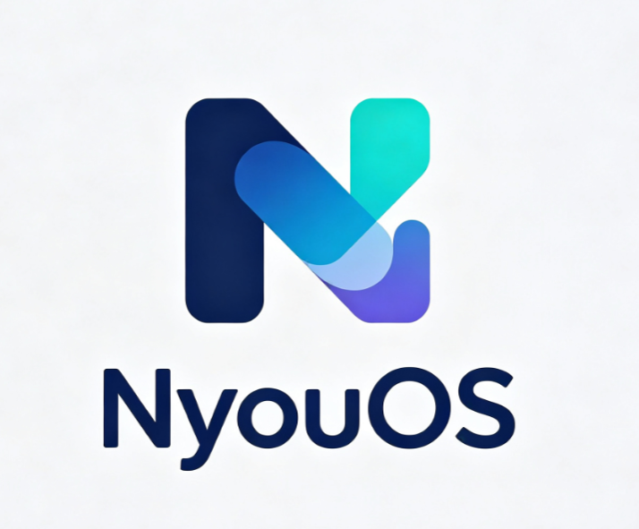

<div align="center">



# NyouOS

**跑在浏览器里的 Fluent 风格桌面操作系统**

纯 HTML + CSS + JavaScript，无需后端，打开即用。

[**🌐 在线体验**](https://nyouos.pages.dev/27.0/) · [English README](README_EN.md)

[](LICENSE)


</div>

---

## 这是什么？

NyouOS 是一个用 Web 技术写的仿真桌面系统——它在浏览器里模拟了一个完整的桌面环境：开始菜单、任务栏、多窗口、文件管理、设置、通知中心、控制中心、小组件，还有一个能帮你操作系统的 AI 助手 **Daola**。

所有数据都存在你自己的浏览器里（localStorage / IndexedDB），不上传任何服务器。

## 在线体验

直接打开 👉 **https://nyouos.pages.dev/27.0/**

首次进入会走开机引导（OOBE），默认 PIN：**1234**。

## 仓库地址

| 平台 | 地址 |
|---|---|
| GitHub | <https://github.com/kevinananda2026/nyouos> |
| Gitee | <https://gitee.com/black-kevin> |

## 本地运行

不需要构建工具， clone 后直接用任意静态服务器打开即可：

```bash
git clone https://github.com/kevinananda2026/nyouos.git
cd nyouos/27.0
# 任选一种方式：
python -m http.server 8000
# 或
npx serve .
```

然后浏览器访问 `http://localhost:8000/`。

> 直接双击 `index.html` 用 `file://` 打开也能跑，但部分浏览器功能（fetch 预加载、摄像头、定位）会受限，推荐用本地 HTTP 服务。

## 特性

- 🖥️ **完整桌面体验**：开机、锁屏、登录、多窗口、任务视图、贴靠布局
- 📁 **文件管理**：虚拟文件系统，所有文件存浏览器本地
- ⚙️ **系统设置**：账户、网络、个性化、应用、语言、隐私、Daola AI、开发者选项
- 🤖 **Daola AI 助手**：内置本地指令系统；可选配置 OpenAI / SiliconFlow 兼容接口（API Key 仅存你本地）
- 🌐 **多语言**：中文、English、ภาษาไทย（泰文）、日本語（日语）
- 🧩 **内置应用**：文件、浏览器、计算器、时钟、天气、快记、相册、相机、媒体播放器、应用商店、开发者中心、终端、任务管理器
- 🎨 **Fluent Design**：云母效果、亚克力材质、圆角动效
- 📱 **PWA 友好**：可安装到桌面

## 键盘快捷键

| 快捷键 | 功能 |
|---|---|
| `Alt` | 打开开始菜单 |
| `Alt + F` | 打开/关闭 Daola AI |
| `Alt + I` | 打开设置 |
| `Alt + L` | 锁屏 |
| `Alt + E` | 打开文件 |
| `Alt + A` | 打开控制中心 |
| `Alt + D` | 最小化所有窗口 |
| `Alt + M` | 最小化当前窗口 |
| `Alt + W` | 任务视图 |

## 开源许可

NyouOS fork 自 [**FluentOS-On-Web**](https://github.com/YoYoPAN1115/FluentOS-On-Web)，原作者 **YoYoPAN1115**，原项目以 MIT 协议开源。

- 原始代码：**MIT License**，版权归 YoYoPAN1115 所有
- NyouOS 的修改与新增部分：**GPLv3 License**，版权归 KevinAnanda 所有

从本 fork 起，整个项目按 GPLv3 分发。完整许可文本见 [LICENSE](LICENSE)。

如果你分发修改后的版本或部署成公开网站，必须同样以 GPLv3 开源并保留原作者与本项目的版权声明。

## 第三方商标

应用商店中出现的微信、支付宝、淘宝、京东、抖音、Bilibili、QQ 音乐等名称与图标，仅用于说明第三方应用来源，其商标与图形版权归各自所有者所有。NyouOS 与上述公司无任何关联或授权关系。"Fluent Design" 是微软的设计语言，本项目与微软无关联。

详见 [商标声明](https://nyouos.pages.dev/trademark.html)。

## 隐私

- 本项目为纯静态页面，不收集任何个人数据，不做商业收费。
- 系统数据全部保存在你的浏览器本地。
- Daola AI 的 API Key 由你自己填写，对话由你的浏览器直接发送到你配置的 API 端点，不经过本站服务器。

详见 [隐私说明](https://nyouos.pages.dev/about.html#privacy)。

## 联系

- 邮箱：<nyouos@163.com>
- 如有侵权内容或建议，欢迎邮件联系。

---

<div align="center">

© 2025-2026 **KevinAnanda** · Fork of [FluentOS-On-Web](https://github.com/YoYoPAN1115/FluentOS-On-Web) by YoYoPAN1115 · MIT / GPLv3

</div>
